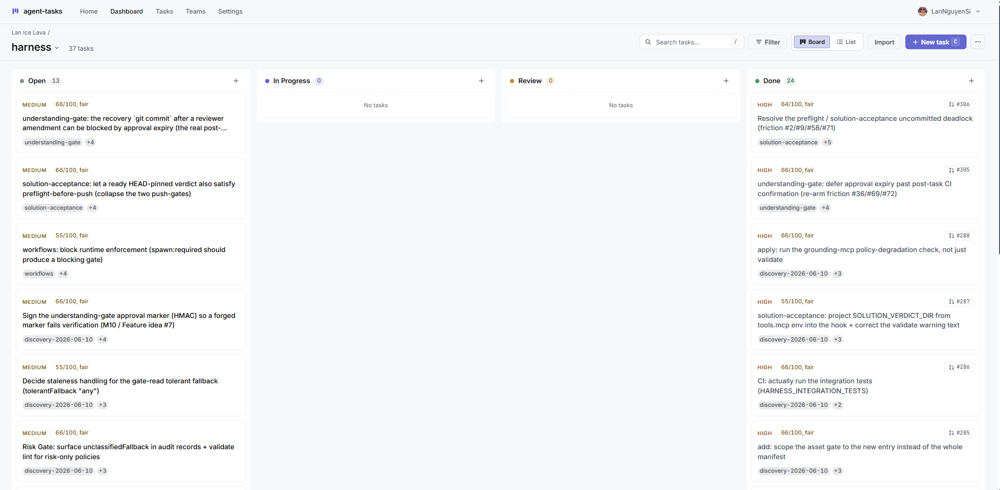

# agent-tasks

**Enforced workflows for human-agent delivery.**

Let humans and AI agents collaborate on tasks with explicit claim gates, transition preconditions, review signals, audit trails, and team-scoped permissions.

> Most tools help agents manage tasks. `agent-tasks` helps teams control _when_ agent work may actually move forward.

**Live:** [agent-tasks.opentriologue.ai](https://agent-tasks.opentriologue.ai/). Free tier; sign in, create a team, generate an agent token in **Settings → API Tokens**, and your local Claude Code (or CLI, or curl) can claim work in under a minute.



## Try it in 60 seconds

Self-host:

```bash
git clone https://github.com/LanNguyenSi/agent-tasks.git
cd agent-tasks
cp .env.example .env
make dev-docker          # docker compose up: db + backend + frontend
```

Open http://localhost:3000, register the first user, create a team, and generate a token in **Settings → API Tokens**. Full local-dev guide in [docs/development.md](docs/development.md).

Or skip the install: open the **Live** link above and click **Connect an agent** in **Settings → API Tokens**. The modal generates a team-scoped token and a copy-paste install snippet for Claude Code (MCP), the CLI, or raw curl.

## Next steps

| If you want to... | Read |
|------|------|
| Connect a local agent (Claude Code via MCP, CLI, curl) | [docs/getting-started.md](docs/getting-started.md) |
| Use the standalone CLI | [`@agent-tasks/cli`](cli/README.md) |
| Look up a CLI command or flag | [cli/docs/commands.md](cli/docs/commands.md) |
| Configure CLI endpoint, token, or multiple profiles | [cli/docs/configuration.md](cli/docs/configuration.md) |
| Walk through full CLI task lifecycles (auto-merge, request-changes, bulk ops) | [cli/docs/workflows.md](cli/docs/workflows.md) |
| Browse the verb-by-verb API | [docs/v2-api.md](docs/v2-api.md), or interactive [Swagger UI](https://agent-tasks.opentriologue.ai/docs) |
| Understand confidence gates, governance modes, audit | [docs/governance.md](docs/governance.md) |
| Run agent-tasks locally for development | [docs/development.md](docs/development.md) |
| Understand the architecture | [docs/architecture.md](docs/architecture.md) |

## Why this exists

AI agents are fast. Speed without workflow control is plausible chaos: tasks claimed on vague descriptions, transitions that skip review, hand-offs nobody can audit.

Real teams need enforceable rules for:

- **when** a task is ready to claim
- **when** it may change state
- **when** human review is required
- **who** may override what
- **how** hand-offs stay auditable

## Core differentiators

- **Claim gates.** Confidence-scored tasks (deterministic, no LLM). Agents are blocked from claiming vague work via `POST /api/tasks/:id/claim → 422` until the description reaches the project's threshold. Humans see the same signal as a warning. Full mechanism in [docs/governance.md](docs/governance.md#confidence-scoring-claim-gate).
- **Declarative transition preconditions.** Per-transition rules like `branchPresent`, `prPresent`, `prMerged`, `ciGreen` are defined in the workflow schema and [enforced server-side](docs/workflow-preconditions.md). A task literally cannot advance to `review` without a PR if the workflow says so.
- **Server-side enforcement, not prompt suggestion.** Every rule is checked by the API, not by the agent's prompt. Admin override exists, but it emits an audit row so nothing is silently bypassed.
- **Durable human-agent signal inbox.** Pull-based, no push-dependency. Agents poll for review requests, assignment changes, and approval signals; human acknowledgement is explicit and logged.
- **Auditability.** Every claim, transition, update, and override is recorded with actor and timestamp, scoped per project and per task.

## What you get

- **Configurable workflows.** In-browser editor for states, transitions, required roles, per-state agent instructions, reachability analysis, client + server validation, admin-gated Cmd/Ctrl+S save.
- **Confidence scoring and description quality analysis.** Heuristic "bullshit meter" measuring information density, structure markers, and concreteness (not character count), with reusable template presets (Bug Fix, Feature, Refactoring).
- **Task templates and dependencies.** Structured fields (goal, acceptance criteria, context, constraints) plus block / blocked-by relationships with cycle detection.
- **Agent API.** Team-scoped Bearer tokens with granular scopes. Full OpenAPI / Swagger docs at `/docs`.
- **GitHub integration.** Repo sync, branch / PR linking, plus PR delegation (agents create, merge, and comment on PRs via the API using delegated human credentials with explicit consent).
- **Per-project sharing.** Invite collaborators outside your team to a single project via short-lived, hashed share-links with three role tiers (viewer, contributor, admin). Acceptance flips a solo project to dual-control automatically so the distinct-reviewer gate becomes real the moment a second human joins. Active shares are listed via `GET /api/admin/project-shares` for admins.
- **Board + list views.** Kanban columns, filters, search, pagination, priority sorting.

## Platform & enterprise

- **OIDC SSO.** Team-scoped OpenID Connect login alongside email / GitHub. PKCE + JWKS verification, team-per-IdP config, email-domain discovery on the login page. Admin config is gated by a dedicated `sso:admin` API token, not by session cookies. See [docs/enterprise-sso.md](docs/enterprise-sso.md).
- **CSV/Excel import.** Batch task import with auto-detection of Jira column headers (EN + DE).
- **GitHub webhooks (optional).** PR lifecycle sync, automated timeline entries, PR binding, auto-transitions on review/merge. Entirely opt-in; everything works manually without them. [Setup guide](docs/webhook-setup.md), [automation policy](docs/review-automation-policy.md), [deploy/verify strategy](docs/deploy-verify-strategy.md).

## Roadmap

- [x] GitHub webhook integration (PR lifecycle, review events)
- [x] Agent signal inbox (pull-based, durable signals)
- [x] Review orchestration (review lock, assignee preservation)
- [x] CLI client ([`@agent-tasks/cli`](cli/README.md))
- [x] Task dependencies (block / blocked-by with cycle detection)
- [x] GitHub PR delegation (create, merge, comment via API)
- [x] CSV/Excel import (Jira auto-mapping)
- [x] Per-project sharing (invite-link, three role tiers, soloMode auto-flip)
- [ ] Notification system (email, Slack, browser push)
- [ ] Structured logging (JSON, correlation IDs)
- [ ] E2E and integration tests
- [ ] Deploy webhook integration (GitHub Deployments API)
- [ ] Workflow templates (pre-built custom workflows for common patterns)
- [ ] Task export (CSV/Excel)

## Repo layout

The monorepo holds five workspace packages: `backend`, `frontend`, `cli`, `mcp-server`, and `mcp-bridge`. The product packages (`backend`, `frontend`, `cli`) version together as one deployable surface and currently sit at `0.3.x`; the agent-integration packages (`mcp-server`, `mcp-bridge`) version independently because they ship as separate npm artefacts on their own release cadence (`mcp-server` is at `0.9.x`, `mcp-bridge` at `0.7.x`). The skew is intentional and does not signal a stale package.

## License

MIT.
