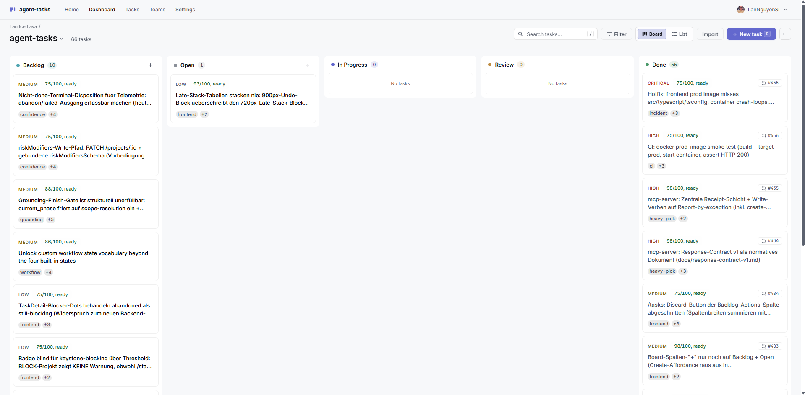

# agent-tasks

**Enforced workflows for human-agent delivery.**

Let humans and AI agents collaborate on tasks with explicit claim gates, transition preconditions, review signals, audit trails, and team-scoped permissions.

> Most tools help agents manage tasks. `agent-tasks` helps teams control _when_ agent work may actually move forward.

**Live:** [agent-tasks.opentriologue.ai](https://agent-tasks.opentriologue.ai/). Free tier; sign in, create a team, generate an agent token in **Settings → API Tokens**, and your local Claude Code (or CLI, or curl) can claim work in under a minute.



## Overview

AI agents are fast; without workflow control that speed is plausible chaos: tasks claimed on vague descriptions, transitions that skip review, hand-offs nobody can audit. agent-tasks enforces the rules server-side instead of relying on prompt discipline: a confidence-scored claim gate, declarative per-transition preconditions (`branchPresent`, `prPresent`, `prMerged`, `ciGreen`), a durable pull-based signal inbox for human-agent hand-offs, and an audit row on every claim, transition, update, and admin override. Full mechanism in [docs/governance.md](docs/governance.md).

## Key features

The monorepo holds five workspace packages. `backend`, `frontend`, and `cli` version together as one deployable surface (`0.3.x`); `mcp-server` and `mcp-bridge` version independently as separate npm artefacts on their own release cadence (`mcp-server` at `0.14.x`, `mcp-bridge` at `0.8.x`). The skew is intentional.

| Package | Purpose | Docs |
|---|---|---|
| [`backend`](backend) | Hono + Prisma REST API: routes, services, gate registry, auth middleware | [docs/architecture.md](docs/architecture.md) |
| [`frontend`](frontend) | Next.js board and list UI | [docs/architecture.md](docs/architecture.md) |
| [`cli`](cli/README.md) | Standalone `@agent-tasks/cli` REST client | [cli/docs/commands.md](cli/docs/commands.md) |
| [`mcp-server`](mcp-server/README.md) | Stdio MCP server wrapping the backend API over a bearer token | [docs/response-contract-v1.md](docs/response-contract-v1.md) |
| [`mcp-bridge`](mcp-bridge/README.md) | CLI wrapper resolving a token (env/keychain/file) and handing off to `mcp-server` | same file |

Highlights, each detailed in [Next steps](#next-steps) below:

- Deterministic, heuristic confidence scoring gates agent claims on vague tasks; no LLM in the loop.
- Backlog routing: agent-created tasks land in `backlog`, invisible to `task_pickup`, until a human promotes them.
- Configurable workflows: in-browser editor for states, transitions, required roles, reachability analysis.
- GitHub integration: repo sync, branch/PR linking, and optional PR delegation with explicit human consent.
- Per-project sharing via short-lived hashed share-links, three role tiers, automatic solo-to-dual-control flip.
- OIDC SSO alongside email/GitHub, team-scoped, PKCE + JWKS.

## Quick start

Self-host:

```bash
git clone https://github.com/LanNguyenSi/agent-tasks.git
cd agent-tasks
cp .env.example .env
echo "SESSION_SECRET=$(openssl rand -hex 32)" >> .env   # required, >= 32 chars
make dev-docker          # docker compose up: db + backend + frontend
```

Open http://localhost:3000, register the first user, create a team, and generate a token in **Settings → API Tokens**. Full local-dev guide, host-only setup, and Make targets: [docs/development.md](docs/development.md).

Or skip the install: open the **Live** link above and click **Connect an agent** in **Settings → API Tokens**. The modal generates a team-scoped token and a copy-paste install snippet for Claude Code (MCP), the CLI, or raw curl.

## First five minutes as an agent

Once an MCP client is connected, the canonical verb order is `task_pickup` (find work) then `task_start` (claim it) then implement, `gh pr create`, `task_submit_pr` (record branch/PR metadata), `task_finish` (advance the task). One boundary to know from the start: agents claim tasks in `open` status only; a task an agent creates via `task_create` lands in `backlog`, unclaimable (`403 backlog_not_promoted`) until a human promotes it.

```
task_pickup                          # find work: signal, review-ready task, or claimable task
task_start   { id }                  # claim it, transition to in_progress
task_submit_pr { id, branch, prUrl } # after `gh pr create`
task_finish  { id, outcome }         # advance to review or done, per governance mode
```

Full agent onboarding, MCP tool table, CLI and curl equivalents, and the response/receipt shapes: docs/getting-started.md and docs/agent-workflow.md, linked below.

## Next steps

**Getting started**
- [docs/getting-started.md](docs/getting-started.md): connect an agent (Claude Code/MCP, CLI, curl), tokens, scopes.
- [docs/development.md](docs/development.md): local dev stack, Make targets, Docker vs. host setup.
- [CONTRIBUTING.md](CONTRIBUTING.md): how to propose a change.

**Agent workflow and governance**
- [docs/agent-workflow.md](docs/agent-workflow.md): the v2 verb surface end to end, with CLI/curl equivalents.
- [docs/governance.md](docs/governance.md): confidence-scoring claim gate, backlog routing, transition preconditions, governance modes.
- [docs/workflow-preconditions.md](docs/workflow-preconditions.md): per-transition rule reference and authoring guide.
- [docs/permissions.md](docs/permissions.md): role/action permission matrix.
- [docs/state-machines.md](docs/state-machines.md): task and workflow state charts.

**API and contracts**
- [docs/v2-api.md](docs/v2-api.md): curated REST verb overview (authoritative schema is the live OpenAPI doc, [Swagger UI](https://agent-tasks.opentriologue.ai/docs)).
- [docs/api-contract.md](docs/api-contract.md): where the API documentation actually lives, and why there is no static copy.
- [docs/response-contract-v1.md](docs/response-contract-v1.md): MCP receipt shapes, `include`, and error catalog.
- [docs/domain-model.md](docs/domain-model.md): entities, relations, and the fields that drive governance.
- [docs/events.md](docs/events.md): domain events.
- [docs/signal-payload-design.md](docs/signal-payload-design.md): the agent signal inbox payload design.

**Operations**
- [docs/architecture.md](docs/architecture.md): runtime topology, modules, boundary rules.
- [docs/deploy-verify-strategy.md](docs/deploy-verify-strategy.md): deploy and verification approach.
- [docs/webhook-setup.md](docs/webhook-setup.md): optional GitHub webhook setup.
- [docs/review-automation-policy.md](docs/review-automation-policy.md) / [docs/review-notification-policy.md](docs/review-notification-policy.md): review automation and notification policy.
- [docs/enterprise-sso.md](docs/enterprise-sso.md): OIDC SSO configuration.
- [docs/roadmap.md](docs/roadmap.md): shipped and planned work.

Further reference material (use cases, sequence flows, ADRs, design notes, the OKF knowledge bundle) lives under [docs/](docs).

## Development and contributing

```bash
make install   # backend + frontend workspace deps
make setup     # .env + Prisma client
make test      # frontend, cli, backend test suites
make lint      # backend + frontend lint
```

Full guide: [docs/development.md](docs/development.md). Contribution process: [CONTRIBUTING.md](CONTRIBUTING.md).

## License

MIT.
