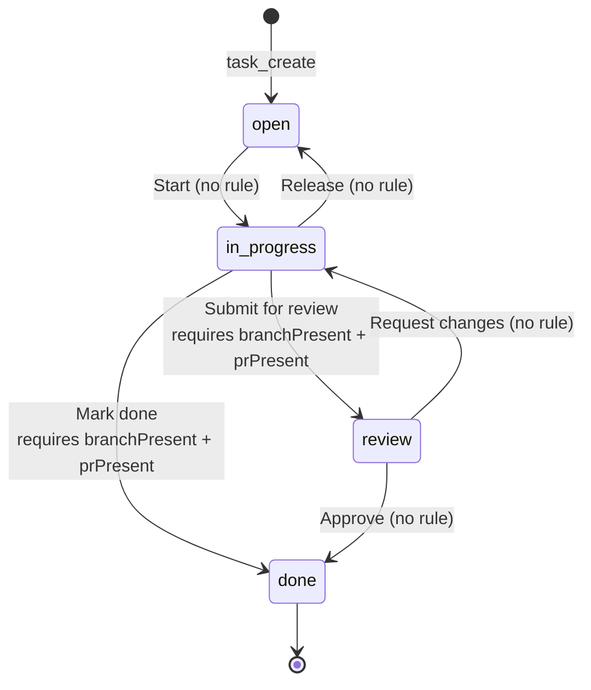

# State machines

Authoritative source: [`backend/src/services/default-workflow.ts`](../backend/src/services/default-workflow.ts), [`backend/src/services/transition-rules.ts`](../backend/src/services/transition-rules.ts), [`backend/src/lib/governance-mode.ts`](../backend/src/lib/governance-mode.ts), [`backend/src/services/gates/`](../backend/src/services/gates/). This page documents the default workflow plus the gates that run on every transition regardless of workflow.

## Default workflow

Four valid statuses. `Task.status` is a free `String` column; custom workflows can define their own state names, but the default workflow uses these four:

`open → in_progress` deliberately has no precondition, so exploratory work without a branch is allowed. Gates only attach on `→ review` and `→ done`.

## Transition-rule layer

Four reusable rules live in `transition-rules.ts` and decorate transition edges that need them:

| Rule | What it checks | Notes |
|---|---|---|
| `branchPresent` | `Task.branchName` is non-empty | Sync. Set via `task_submit_pr` or PATCH. |
| `prPresent` | `Task.prNumber` is non-empty | Sync. Set via `task_submit_pr` or PATCH. |
| `ciGreen` | GitHub Check Runs on the bound PR are all green | Hits the GitHub API. **Fails closed** on missing token or network error. |
| `prMerged` | The bound PR is merged | Hits the GitHub API. Fails closed on missing token or network error. |

Custom workflows can attach any subset of the four rules to any transition. The default workflow only attaches `branchPresent + prPresent` to the two `in_progress → ...` edges.

`force=true` from a team admin bypasses every rule. The bypass is audit-logged as `task.transitioned.forced` and emits a `task_force_transitioned` signal to the claimant + active reviewer.

## Governance-tier gates

These run on every state-write path (transition, PATCH `{ status }`, `task_finish`, REST merge, `task_merge`). The active set depends on `Project.governanceMode`:

| Tier | Self-review (`review → done` by claimant) | Self-merge (`pull_requests_merge` / `task_merge` / `task_finish` by claimant) | Side effect on success |
|---|---|---|---|
| `AUTONOMOUS` | allowed | allowed | none |
| `AWAITS_CONFIRMATION` | allowed | allowed | `self_merge_notice` signal to every human team member |
| `REQUIRES_DISTINCT_REVIEWER` | rejected with `403 forbidden (reason: self_review)` | rejected with `403 self_merge_blocked` | none |

`AWAITS_CONFIRMATION` is the async-HITL middle ground: the agent is not blocked, but every human on the team gets a notification they can act on.

## Server-derived governance

`Project.soloMode` and `Project.requireDistinctReviewer` are deprecated. Read paths go through `resolveGovernanceMode` (`backend/src/lib/governance-mode.ts`); writes go through the new enum and sync-write the legacy columns via `legacyFlagsFromGovernanceMode` for one release of backward compat.

Inviting a second human into a soloMode project auto-flips the project off `AUTONOMOUS` (`project.solo_mode_disabled_by_share` audit row) so the distinct-reviewer gate becomes meaningful the moment a second reviewer exists.

## Merge-event paths

Two paths reach the task and they can land it in different states:

| Path | How it fires | Resulting `status` |
|---|---|---|
| REST merge | `POST /api/github/pull-requests/:n/merge` (used by MCP `task_merge` and `pull_requests_merge`) | hardcoded `done` after a successful merge |
| Webhook merge | PR merged through the GitHub UI or `gh pr merge` | picked by `pickMergeTargetStatus` from `governanceMode`: `done` for `AUTONOMOUS` / custom workflow, otherwise `review` |

Both paths run the self-merge gate first; only the resulting status differs. Tooling that wraps both must treat them as separate code paths.

## Confidence gate

A task whose description does not score above `Project.confidenceThreshold` (default `60`) cannot be claimed. `task_pickup` filters such tasks out; `task_start` rejects with `422 confidence_below_threshold`. `task_pickup` also skips tasks whose `blockedBy` parents are not all `done`, so the dependency graph is enforced at claim time, not at transition time.

## Further reading

- [`workflow-preconditions.md`](workflow-preconditions.md) — full reference for the precondition rule layer.
- [`governance.md`](governance.md) — confidence scoring, governance modes, audit behaviour.
- [`events.md`](events.md) — every audit action + signal type emitted on these state changes.
